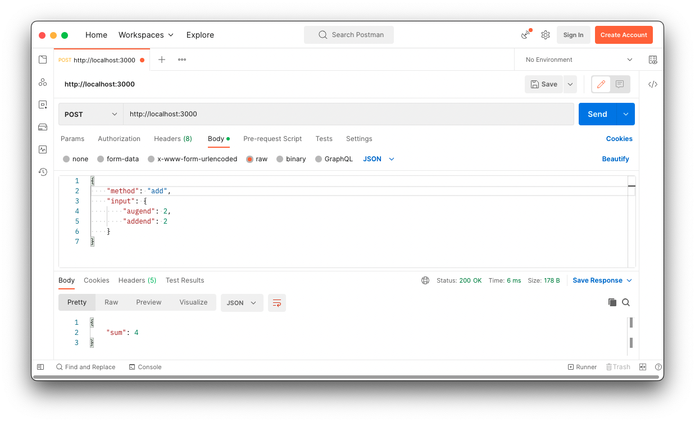
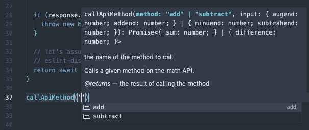
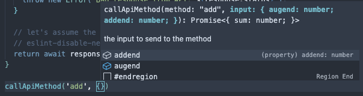
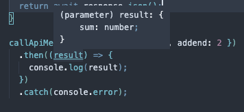

# How to write a typesafe API with TypeScript

In this article, we're going to write a simple API server, and a client to
access it. The client code will use types which are output from the server code,
so that the API method inputs and outputs are typed even on the client. And best
of all, there is no complicated codegen involved!

## Overview

You're probably familiar with REST APIs, but possibly not so with RPC. While
RESTful services map all actions onto HTTP routes and methods, RPC (Remote
Procedure Call) hides all those details and just gives you functions to call, as
if they were part of your client code. The actual details of the communication
("transport") layer is up to the implementation, so it's not so much a standard
as it is a concept.

---

### Sidebar — but wait, I thought you had to use REST?

Although RPC significantly predates REST, it was the case up until recently that
if you weren't doing REST, then you were Doing It Wrong. But RPC is back, baby!

Personally, I went through a journey from REST, getting frustrated with having
to shoehorn everything into a resource path and HTTP method, to getting on the
GraphQL badwagon, to realizing that the latter was just a needlessly verbose way
of calling functions.

Besides, Amazon basically use RPC, and they run half the internet.

---

Although theoretically the server could send you back any old junk, and
therefore by definition anything you get from it is typed as `unknown`, it's
convenient to assume the server will do what it promises and give everything
types. (Especially if you're also writing the server...)

Since TypeScript can be used for both server and client code, it would be useful
to have some way to use the types of the API methods on the client. Of course,
we need to be quite sure we're not going to accidentally include any server-side
code in our client bundle.

## Setup

I'm using Node 18 and NPM 8 for this. If you've got
[nvm](https://github.com/nvm-sh/nvm), you can run `nvm use 18` to use the same
versions.

Create a directory for the project, and make a `package.json` file in there. I
called mine `typesafe-api`. This will be a
[mono repository](https://monorepo.tools/#what-is-a-monorepo), so this root
`package.json` will contain some config for that:

```json
{
  "name": "typesafe-api",
  "version": "0.0.1",
  "workspaces": ["packages/**"]
}
```

By the end of this article, we're going to have 3 packages in the monorepo:

- `api` — the API server
- `api-types` — the types describing our API, that we can import into any
  clients
- `client` — a simple client for demonstration

## The API

Okay, let's get started on the actual API. So we don't get lost in the
complexities of an unrelated problem, we're just going to build a "math service"
that will have two methods: add and subtract.

Create a directory at `packages/api` and put a `package.json` in it. We're going
to use [koa](https://koajs.com/) as our server framework, because it's
lightweight and deals with promises unlike Express. For validation, I like
[zod](https://www.npmjs.com/package/zod). We're also going to include
[sucrase](https://www.npmjs.com/package/sucrase) to allow us to run the
TypeScript without compiling it first, because it saves, like, 10 characters
each time.

Altogether, the `package.json` looks like this:

```json
{
  "name": "api",
  "version": "0.0.1",
  "private": true,
  "scripts": {
    "start": "sucrase-node src/server"
  },
  "devDependencies": {
    "@types/koa": "^2.13.5",
    "@types/koa-bodyparser": "^4.3.10",
    "sucrase": "^3.29.0",
    "typescript": "^4.9.4"
  },
  "dependencies": {
    "koa": "^2.14.1",
    "koa-bodyparser": "^4.3.0",
    "zod": "^3.19.1"
  }
}
```

If you're just copy-and-pasting my package.json, don't forget to run
`npm install` to actually install the dependencies listed.

### The "framework"

Before we get into the service code we're going to set up some types. I've put
these in a file called `framework.ts` since they're not particularly specific to
the API we're building.

We need a type to represent a description of an API method. For our purposes, an
API method is described by its input validator and the actual method. In a
production scenario it might also have context, and an output validator.

Here's what the type looks like:

```ts
import { Schema } from 'zod';

/**
 * Represents the definition of an API method.
 */
export interface ApiMethodSpec<Input, Output> {
  input: Schema<Input>;
  method: (input: Input) => Promise<Output>;
}
```

A "service" is just a collection of methods, which we'll put into an object:

```ts
export type ApiService = {
  [method: string]: ApiMethodSpec<any, any>;
};
```

So that we get type inference when we're writing API method implementations,
let's also define a convenience method:

```ts
/**
 * Convenience method to constrain the types in the right way.
 * @param spec the definition of the API method
 */
export function createApiMethod<Input, Output>(
  spec: ApiMethodSpec<Input, Output>,
) {
  return spec;
}
```

As you can see it simply returns its only argument. You'll find out why that's
useful in the next section.

### The actual API methods

Since huge files are annoying, let's put the `add` method in a new file, called
`add.ts`. It looks like this:

```ts
import { z } from 'zod';
import { createApiMethod } from './framework';

export const add = createApiMethod({
  input: z.object({
    augend: z.number(),
    addend: z.number(),
  }),
  method: async (input) => {
    return { sum: input.augend + input.addend };
  },
});
```

As you can see we're using the `createApiMethod` function from before. This
means that the type of the `input` argument in the `method` function will be
automatically inferred from the type represented by the input validator. Which
is pretty cool..!

The method is asynchronous because normally API methods are, even though this
sample one isn't. Other than that, we're simply adding two numbers together (and
calling them by their mathematically correct names to be pretentious).

You should be able to figure out what `subtract.ts` is going to look like. In
case you can't, or if you're feeling lazy, here it is:

```ts
import { z } from 'zod';
import { createApiMethod } from './framework';

export const subtract = createApiMethod({
  input: z.object({
    minuend: z.number(),
    subtrahend: z.number(),
  }),
  method: async (input) => {
    return { difference: input.minuend - input.subtrahend };
  },
});
```

Nothing surprising there, other than finding out that the parts of a subtraction
have weird names.

Now that we've got all the methods of our simple math service done, let's put it
together in `mathService.ts`:

```ts
import { add } from './add';
import { subtract } from './subtract';

export const mathService = {
  add,
  subtract,
};

export type MathService = typeof mathService;
export type MathServiceMethod = keyof MathService;
```

So `mathService` is an object with both the `add` method and `subtract` method.
We've also got a couple of convenient types to save keystrokes later.

Hopefully you can see that `MathServiceMethod` represents the name of a method
in `mathService`, and is equivalent to `"add" | "subtract"`.

### The server code

We're now going to write some code that allows these methods to be called over
HTTP. But first let's add another function to our `framework.ts` file. This
function is going to call a method on the given service, if it exists,
performing input validation beforehand:

```ts
/**
 * Calls the given API method if possible.
 * @param service the service the method is to be found on
 * @param method the name of the method
 * @param input the input for the method
 * @returns the result of running the method for the given input
 */
export async function callApiMethodSafe<Service extends ApiService>(
  service: Service,
  method: string,
  input: unknown,
): Promise<unknown> {
  // make sure the method is valid
  if (!(method in service)) {
    throw new Error(`Unrecognized method name ${method}`);
  }

  const spec = service[method];

  // validate the input
  const inputValidation = spec.input.safeParse(input);

  if (!inputValidation.success) {
    throw new Error('Validation failed: ' + inputValidation.error.message);
  }

  // actually call the method and return the result
  return (await spec.method(inputValidation.data)) as unknown;
}
```

Now all that is left to do is the HTTP bit. In a new file called `server.js`,
let's put in the bare bones of a Koa server:

```ts
import Koa from 'koa';
import bodyParser from 'koa-bodyparser';

const app = new Koa();

app.use(bodyParser());

app.use(async (ctx) => {
  // call the API method
});

const port = process.env.PORT || 3000;

app.listen(port, () => {
  console.log(`listening on ${port}`);
});
```

This creates a new Koa server, installs some middleware to let it understand
JSON request bodies, and starts it listening on port 3000.

For our implementation of RPC, we're going to use request bodies that look like
something like this:

```json
{
  "method": "<method name>",
  "input": {}
}
```

So to call a method, you send a request with some JSON, where the `method` field
indicates the name of the method you want to call, and the `input` field is the
input you want to send to the method.

For example, to call the `add` method, you could use the following request body:

```json
{
  "method": "add",
  "input": {
    "augend": 2,
    "addend": 2
  }
}
```

The response JSON will be whatever the method returns, so in the above case:

```json
{
  "sum": 4
}
```

Since we already have Zod installed, let's use it to validate the transport data
structure. Add the following to your `server.js`:

```ts
import { z } from 'zod';

const bodySpec = z.object({
  method: z.string(),
  input: z.any(),
});
```

To finish off, let's actually call the method. Replace the "call the API method"
comment with the following code:

```ts
const body = bodySpec.parse(ctx.request.body);
ctx.body = await callApiMethodSafe(mathService, body.method, body.input);
```

If the `bodySpec` validation fails, it will throw an error. Otherwise, it calls
the method using the function we wrote earlier, and returns the result back to
the client.

If you want, you can go ahead and start the server and give a test in your
favorite HTTP client, e.g. Postman or cURL. To start the server, run `npm start`
from the `packages/api` directory.

Here's what my trial run on Postman looked like:



It works! The bottom pane shows the result from calling the API.

## The API types package

We want to make a package that we can import in any client code and get the
types resulting from the API methods that we just wrote. Make a new directory at
`packages/api-types`, and put a simple `package.json` in it:

```json
{
  "name": "api-types",
  "version": "0.0.1",
  "types": "lib/index.d.ts"
}
```

This package is only going to export types, not any code, and those types will
be available in the `lib` directory. But where will the types come from?

We can build them from the API code! Go back to your `packages/api` directory
and create a `tsconfig.json`:

```json
{
  "compilerOptions": {
    "strict": true,
    "module": "NodeNext",
    "declaration": true,
    "declarationMap": true,
    "emitDeclarationOnly": true,
    "declarationDir": "../api-types/lib"
  },
  "include": ["src"]
}
```

Here you can see we're choosing to only emit types (using `emitDeclarationOnly`)
— this way we can be sure we don't accidentally include any sensitive server
code in our client. The destination directory for the types will be our
`api-types` package that we just made (using `declarationDir`).

Quick aside: the `tsconfig.json` also causes the compiler to output a
[declaration map](https://www.typescriptlang.org/tsconfig#declarationMap) using
the `declarationMap` option. This allows VS Code to show us the original source
code if we `⌘ + click` on a type in the client.

Before moving onto implementing the client, we also want to define a couple of
utility types so we can infer the input type and return type of a given API
method. Go back to `packages/api/src/framework.ts` and add the following:

```ts
/**
 * Returns the input type for a given method spec.
 */
export type inferInputType<T> = T extends ApiMethodSpec<infer R, any>
  ? R
  : never;

/**
 * Returns the output type for a given method spec.
 */
export type inferOutputType<T> = T extends ApiMethodSpec<any, infer R>
  ? R
  : never;
```

If this syntax looks unfamiliar to you, we're using a really cool feature of
TypeScript here called _conditional types_. You can read more about them and
their use with the `infer` keyword
[here](https://learntypescript.dev/09/l2-conditional-infer).

Finally, add an `index.ts` to `packages/api/src`, which will end up being the
entrypoint for the `api-types` package:

```ts
export type { MathService, MathServiceMethod } from './mathService';
export type { inferInputType, inferOutputType } from './framework';
```

It basically just exports the types that consumers of the API will need.

Once you've done this, make sure you compile the code by running `npx tsc` from
the `packages/api` directory.

## The client

Now, to prove that it all works, let's write a really simple client. Create a
new directory at `packages/client` and add a `package.json`:

```json
{
  "name": "client",
  "version": "0.0.1",
  "scripts": {
    "start": "sucrase-node src/index"
  },
  "devDependencies": {
    "@types/node-fetch": "^2.6.2",
    "api-types": "file:../api-types",
    "sucrase": "^3.29.0"
  },
  "dependencies": {
    "node-fetch": "^2.6.7"
  }
}
```

This lists the `api-types` package we created earlier as a dependency of our new
`client` package. It also includes `sucrase` again so we can easily run the code
and `node-fetch` to do the actual talking to the server in a familiar fashion.

First we need to write a function to call an arbitrary API method. Create a new
file under `packages/client/src` called `index.ts`:

```ts
import type {
  inferInputType,
  inferOutputType,
  MathService,
  MathServiceMethod,
} from 'api-types';
import fetch from 'node-fetch';

/**
 * Calls a given method on the math API.
 * @param method the name of the method to call
 * @param input the input to send to the method
 * @returns the result of calling the method
 */
export async function callApiMethod<Method extends MathServiceMethod>(
  method: Method,
  input: inferInputType<MathService[Method]>,
): Promise<inferOutputType<MathService[Method]>> {
  const response = await fetch('http://localhost:3000', {
    method: 'post',
    body: JSON.stringify({
      method,
      input: input as unknown,
    }),
    headers: { 'Content-type': 'application/json' },
  });

  if (response.status !== 200) {
    throw new Error(`Bad response from API: ${response.status}`);
  }

  return await response.json();
}
```

Here, we're using `node-fetch` to connect to the server we wrote and send a
request formatted the way it expects. If we get a `200` response, everything is
good and we can return the result.

The clever bit is importing the types from `api-types`, and then using our
`inferInputType` and `inferOutputType` utilities to get the right types for
whatever method is specified.

Now in the same file, we can start writing a call to `callApiMethod`, and VS
Code will help us. Because it's all strongly typed, VS Code knows that the only
two valid values for the `method` parameter are `"add"` or `"subtract"`:



Even cooler, once we pick "add", VS Code knows what type `input` should be:



You can see that IntelliSense is suggesting `addend` and `augend` as keys rather
than `minuend` and `subtrahend`.

(Hey, so there _was_ a reason I didn't just call the parameters for the `add`
and `subtract` methods `a` and `b`!)

It also knows what the return type is:



Very cool.

So to finish off our little client, let's finish writing the lines you can sort
of see in the screenshots above:

```ts
callApiMethod('add', { augend: 2, addend: 2 })
  .then((result) => {
    console.log(result);
  })
  .catch(console.error);
```

I've swapped to `.then` because `await` isn't always allowed at the top level of
the file. The code just calls the `add` API and logs the result.

Give it a whirl by running `npm start` in `packages/client`, and it should print
the result (assuming your server is still running).

## Wrap up

That's pretty much it. Hopefully you've enjoyed following along while we:

- built a simple server to add and subtract numbers
- set up a package to export the types of our API
- built a simple client to use those types and call the API

A real implementation might also validate the response of the methods, and
perhaps have some way to pass in server context such as a database connection.
The client might also have to be concerned with authentication, and the server
might be implemented as an AWS lambda function rather than using Koa. But
otherwise, that's the basics!

If you don't want to write it all yourself, [tRPC](https://trpc.io/) is fairly
good, and the ideas in this article owe some credit to that project.

## Hire me

If you liked this article, why not hire me to write more just for you? I've got
loads of experience with writing software, and can also string sentences
together — a killer combo!

This article was written in US English in a moderately informal register, but I
can also be super serious and write UK English to taste.

Find out (marginally) more about me at
[stewarteverett.com](https://stewarteverett.com).
